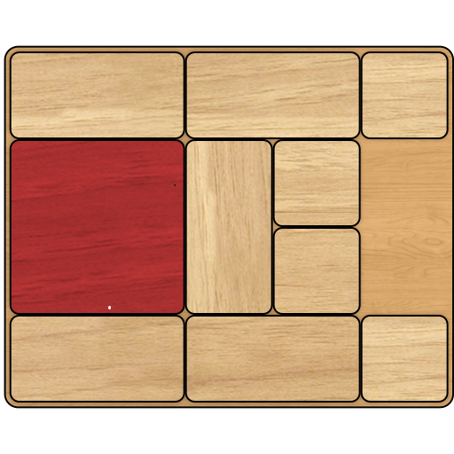

# WoodenPuzzleSolver
Program for giving the solution and individual steps to solve to any layout of the wooden puzzle.

Input => Puzzle Orientation String Representation

Output => Step by step move list to solve puzzle

Example Input: BBDCADEDEBBD

Ouput will return every move required to move piece "C" into the final solved state.
